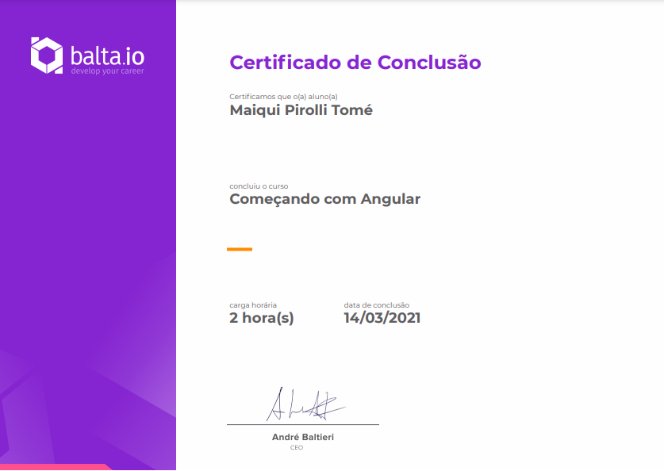
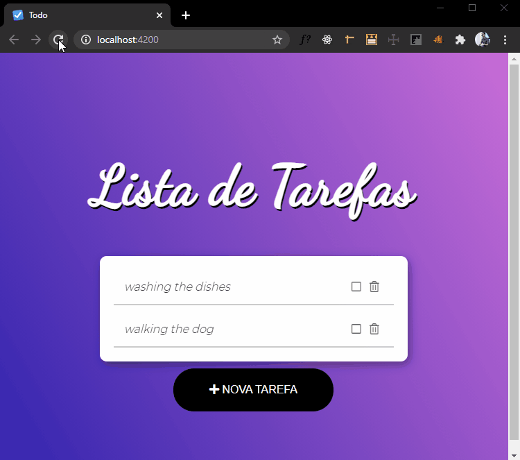

# TODO LIST
## 📚 Balta.io's Course Project: Getting started with Angular
<a href="https://balta.io/certificados/1fd6a983-6805-4bb6-8cbd-274e5364d9db">certificate link</a>

 

## 🎨 final result

## 🚀 Technologies used in this project

Made with ♥ by Maiqui Tomé 😀
  

*Reach out to me* 👇

